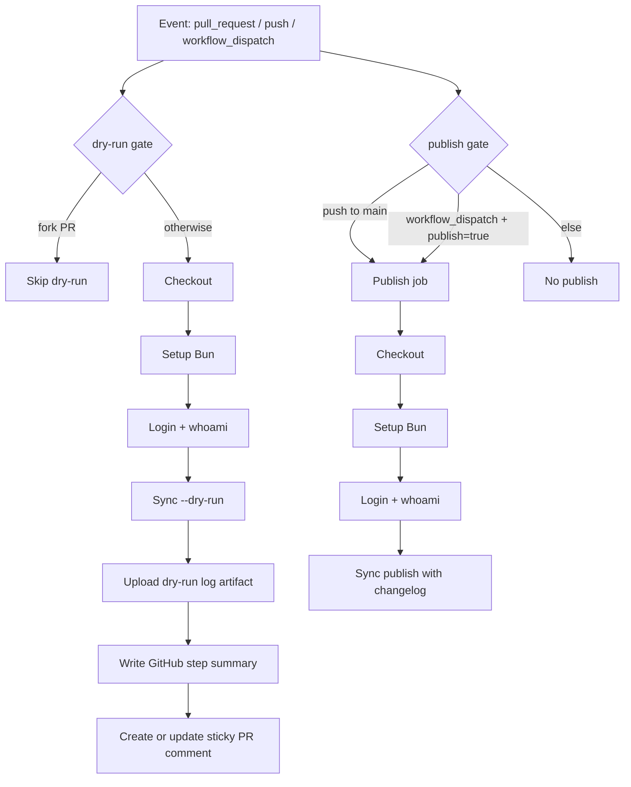

# ClawHub Sync Workflow Reference (official lane)

This guide documents the intended behavior of `.github/workflows/clawhub-sync.yml` and the ClawHub CLI calls it makes.

## Scope

- Trigger path: `skills/official/**`
- Sync workdir: `skills/official/sandbox`
- Non-synced lane: `skills/community/**` is intentionally excluded from this workflow.

## Trigger Matrix

| Event | Runs `dry-run` | Runs `publish` |
| --- | --- | --- |
| `pull_request` touching `skills/official/**` | Yes (except fork PRs) | No |
| `push` to `main` touching `skills/official/**` | Yes | Yes |
| `workflow_dispatch` with `publish=false` | Yes | No |
| `workflow_dispatch` with `publish=true` | Yes | Yes |

## Job Flow

1. `dry-run`:
   - checkout repo
   - install Bun
   - login with `CLAWHUB_TOKEN`
   - run `clawhub sync --dry-run` against `skills/official/sandbox`

2. `publish` (gated):
   - requires `dry-run`
   - runs only on `push` to `main` or manual dispatch with `publish=true`
   - checkout repo
   - install Bun
   - login with `CLAWHUB_TOKEN`
   - run `clawhub sync` (no `--dry-run`) with changelog

## Developer Experience Outputs

The `dry-run` job emits reviewer-friendly outputs:

- Step summary (`$GITHUB_STEP_SUMMARY`) with:
  - workdir
  - bump
  - parsed would-upload count
  - CLI version
- Uploaded artifact: `clawhub-dry-run.log` (7 day retention)
- Sticky PR comment (marker: `<!-- clawhub-dry-run-comment -->`) that is created/updated with:
  - workdir
  - bump
  - would-upload count
  - CLI version

## Permissions

- `contents: read`
- `pull-requests: write` (required for PR comments)

## Verified CLI Calls

Commands validated against `clawhub` CLI v0.7.0 help output.

| Command/Flag | Valid | Notes |
| --- | --- | --- |
| `clawhub login --token <token>` | Yes | Supported by `clawhub login --help` |
| `clawhub whoami` | Yes | Supported by `clawhub whoami --help` |
| `clawhub sync --all` | Yes | Non-interactive upload set |
| `clawhub sync --dry-run` | Yes | Safe preview mode |
| `clawhub sync --bump patch|minor|major` | Yes | Matches documented enum |
| `clawhub sync --changelog <text>` | Yes | Used for update publish metadata |
| `clawhub sync --tags <csv>` | Yes | Comma-separated tags (e.g. `latest`) |
| `clawhub sync --concurrency <n>` | Yes | Registry check fanout (configured to 1 to reduce rate-limit failures) |
| global `--workdir <dir>` | Yes | Used as `skills/official/sandbox` |
| global `--dir .` | Yes | Scan root inside workdir |

## Mermaid (pairing diagram)

## Explicit Run Rules

- `dry-run` runs on:
  - `pull_request` when `skills/official/**` changes, except fork PRs
  - `push` to `main` when `skills/official/**` changes
  - `workflow_dispatch` (always)
- `publish` (non-dry-run) runs only on:
  - `push` to `main` when `skills/official/**` changes
  - `workflow_dispatch` with `publish=true`
- Net effect:
  - PRs: dry-run only
  - Push to `main`: dry-run + publish
  - Manual dispatch: always dry-run; publish only when explicitly enabled

## Pairing Checklist

- Confirm secret name: `CLAWHUB_TOKEN`
- Confirm official lane path remains `skills/official/**`
- Confirm only `skills/official/**` changes should trigger this workflow (PR and push).
- Confirm desired default bump (`patch`) for push and dry-run dispatches
- Confirm changelog text format is acceptable
- Confirm fork PR behavior (skip vs unauthenticated preview)
- Confirm sticky comment wording and marker strategy are acceptable
