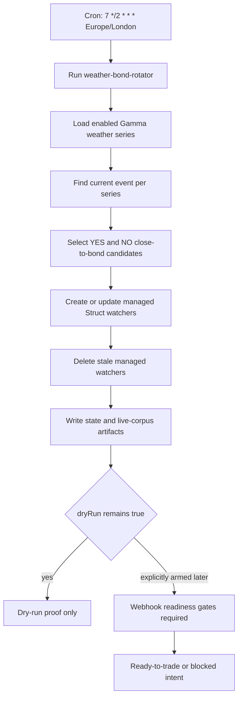

# Weather Bond Rotator

Refreshes exact Gamma weather Struct close_to_bond watchers on a recurring schedule, with dry-run trading as the default posture.

## What it does

- Runs the `weather-bond-rotator` workflow every two hours at minute 7 in the `Europe/London` timezone.
- Keeps enabled weather series IDs in config and asks the predictions agent for the current event in each series.
- Creates or updates Struct `close_to_bond` YES and NO watchers for selected child-market candidates.
- Deletes stale managed watchers so only current allowed weather markets remain armed for webhook proof.
- Uses small default dry-run limits: 5 USD notional candidate sizing, 1 USD max trade notional, and 5 USD max daily notional.

## Capability contract

- Trigger: cron `7 */2 * * *` in `Europe/London`.
- Inputs:
  - workflowId: `weather-bond-rotator`
  - mode: `rotator`
  - minProbability: 0.95
  - maxNoProbability: 0.05
  - watcherTtlHours: 48
  - maxSpread: 0.02
  - maxOrderbookAgeMs: 30000
  - dryRun: true
- Outputs:
  - active weather watcher set
  - selected weather market candidates
  - replayable state artifact at `/workspace/outputs/weather_bond_state.json`
  - live proof corpus at `/workspace/outputs/weather_bond_live_corpus.json`
- Side effects:
  - reads prediction market and orderbook data
  - creates, updates, and deletes managed Struct watchers
  - writes AgentFS SQLite state and run artifacts
  - emits dry-run order intent unless a separate explicitly armed submit path passes readiness gates
- Failure modes:
  - no current weather event for an enabled series
  - market identity cannot be resolved exactly
  - orderbook is stale, too wide, or unavailable
  - exposure caps block readiness
  - Struct watcher mutation fails or returns stale state
- Strategy state transitions:
  - idle -> scanning on each cron tick
  - scanning -> watcher-refresh when eligible candidates exist
  - watcher-refresh -> dry-run-ready when proof artifacts are written
  - dry-run-ready -> blocked when identity, orderbook, or exposure gates fail
  - dry-run-ready -> ready-to-trade only when dryRun is false and all webhook readiness gates pass

## Schedule diagram

## Setup

1. Install the workflow artifact from `workflows/weather-bond-rotator/references/weather-bond-rotator@latest.ts`.
2. Configure enabled Gamma weather series IDs and keep `dryRun: true` for first runs.
3. Set the recurring schedule to `7 */2 * * *` in `Europe/London`.
4. Confirm Struct watcher credentials and predictions market tools are available in the execution environment.
5. Review `/workspace/outputs/weather_bond_state.json` and `/workspace/outputs/weather_bond_live_corpus.json` before any explicit submit run.

## Quick Copy Prompt (Ask Gina)

~~~text
Create a scheduled workflow recipe:
- Name: Weather Bond Rotator
- Execute with agent: predictions
- Workflow: weather-bond-rotator@latest
- Schedule: 7 */2 * * *
- Timezone: Europe/London
- Task: Refresh exact Polymarket weather close_to_bond watchers for enabled Gamma weather series. Select the current event per series, manage YES and NO watcher candidates, delete stale managed watchers, write replayable proof artifacts, and keep trading in dry-run mode unless explicitly armed later.
- Risk rules: dryRun true, maxTradeNotionalUsd 1, maxDailyNotionalUsd 5, maxPerSeriesDailyNotionalUsd 2, maxSpread 0.02, maxOrderbookAgeMs 30000.

Then return:
- Ready-to-run workflow recipe config
- Watcher mutation summary
- Proof artifact paths
- Any blocked readiness reasons
~~~

## Security and permissions

- security.permissions: read-market-data, manage-webhook-watchers, write-agentfs-state, write-run-artifacts, place-order.
- Keep `dryRun: true` until a reviewed submit run explicitly arms execution.
- Do not copy secrets, API keys, private keys, auth headers, or raw secret-bearing logs into artifacts.

## Evidence

- Source recipe: `specs/recipes/weather-bond-rotator.recipe.json`.
- Workflow source: `workflows/weather-bond-rotator/references/weather-bond-rotator@latest.ts`.
- Test evidence: weather workflow tests cover dry-run recipe defaults, AgentFS state paths, replay corpus output, and trade execution readiness gates.

## Backlinks

- [Workflow](../../workflows/weather-bond-rotator/README.md)
- [Strategy](../../strategies/trading/strategy-weather-bond-rotator.md)
- [Category](../../docs/categories/recipes.md)
- [Awesome Gina Index](../../README.md)
