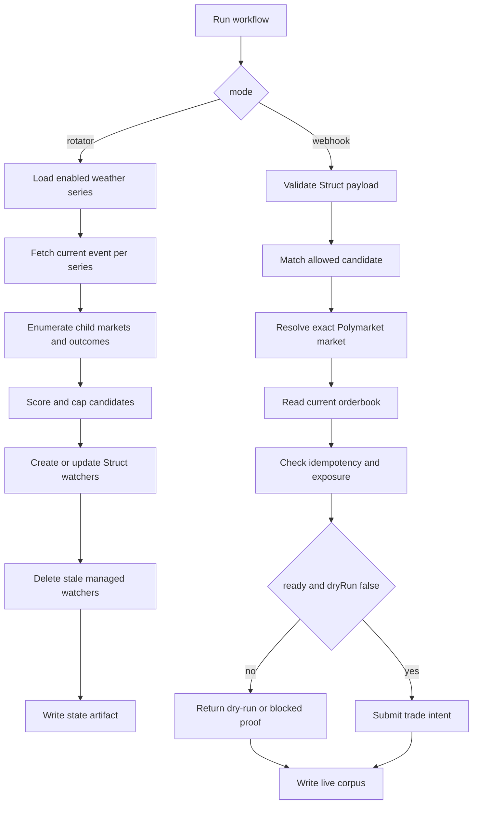

# Weather Bond Rotator Workflow

Workflow submission with artifact at `workflows/weather-bond-rotator/references/weather-bond-rotator@latest.ts`.

## What it does

- Keeps an exact allowed registry of Polymarket Gamma daily weather series.
- In rotator mode, selects current weather events, enumerates eligible child markets, creates YES/NO close-to-bond watcher candidates, and deletes stale managed watchers.
- In webhook mode, validates Struct callbacks against the allowed exact candidate, proves current fillability with orderbook data, writes replayable proof artifacts, and emits a dry-run, blocked, or ready-to-trade order intent.
- Keeps production live trading out of the default path by using `dryRun: true` unless explicitly armed.

## Capability contract

- Trigger: manual or scheduled rotator runs, plus webhook mode for Struct `close_to_bond` callbacks.
- Inputs:
  - `mode` (`rotator` or `webhook`)
  - exact weather `seriesRegistry`
  - probability thresholds and candidate-selection caps
  - orderbook age, spread, slippage, and exposure limits
  - `dryRun`, defaulting to `true`
- Outputs:
  - rotator result with selected events, candidates, watcher mutations, and cleanup counts
  - webhook proof with exact market identity, orderbook snapshot, idempotency key, and order intent
  - AgentFS state and live-corpus artifact paths
- Side effects:
  - reads Polymarket Gamma, CLOB/orderbook, and Struct callback payload data
  - creates, updates, and deletes managed Struct watchers
  - writes AgentFS SQLite state and JSON artifacts
  - can call `tradePredictionMarket` only when `dryRun: false`, the intent is `ready_to_trade`, and identity/orderbook/exposure gates have passed
- Failure modes:
  - no active event for an enabled series
  - missing token, wrong condition, or wrong callback candidate
  - orderbook stale, spread too wide, ask above limit, or insufficient depth
  - exposure cap exceeded or duplicate idempotency key
  - upstream provider timeout or malformed response

## Workflow steps

1. Load or initialize AgentFS state tables for candidates, plans, intents, exposure, and skips.
2. In rotator mode, fetch current events for enabled weather series and enumerate candidate child markets.
3. Score and cap candidates, then reconcile Struct watchers for the managed candidate set.
4. In webhook mode, validate the callback payload against the allowed market/candidate identity.
5. Read the current orderbook, calculate economics, and build an idempotent order intent.
6. Persist replayable proof to `/workspace/outputs/weather_bond_state.json` and `/workspace/outputs/weather_bond_live_corpus.json`.
7. Return dry-run or blocked proof by default; submit an order only when explicitly armed and all gates pass.

## Execution diagram

## Setup

1. Keep artifact at `workflows/weather-bond-rotator/references/weather-bond-rotator@latest.ts`.
2. Install as `/workspace/.harness/workflows/weather-bond-rotator@latest.ts`.
3. Start with rotator mode and dry-run inputs:
   - `{"mode":"rotator","dryRun":true,"notionalUsd":5,"marketSelectionMode":"current_event_all_markets"}`
4. Configure Struct callbacks to run webhook mode only for managed candidates emitted by the rotator.
5. Review state and live-corpus artifacts before changing `dryRun` to `false`.

## Security and permissions

- security.permissions: read-market-data, manage-struct-watchers, read-orderbook, write-run-artifacts, write-agentfs-state, place-prediction-trade.
- Default runs are dry-run and should not submit live orders.
- Live-money execution requires separate operator approval, account limits, exposure caps, and replayable proof review.
- Do not store tokens, private keys, auth headers, webhook secrets, or raw secret-bearing provider logs in state or artifacts.

## Evidence

- Source artifact: `workflows/weather-bond-rotator/references/weather-bond-rotator@latest.ts`
- Companion strategy: `strategies/trading/strategy-weather-bond-rotator.md`
- Companion recipe: `recipes/predictions/recipe-weather-bond-rotator.md`
- Unverified local proof from originating Gina app: the workflow source was covered by dry-run gate, state-contract, and backtester tests before submission packaging.

## Backlinks

- [Category](../../docs/categories/workflows.md)
- [Awesome Gina Index](../../README.md)
